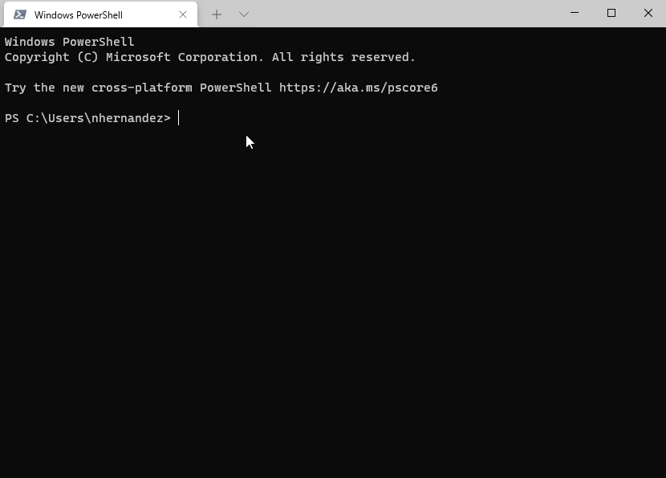
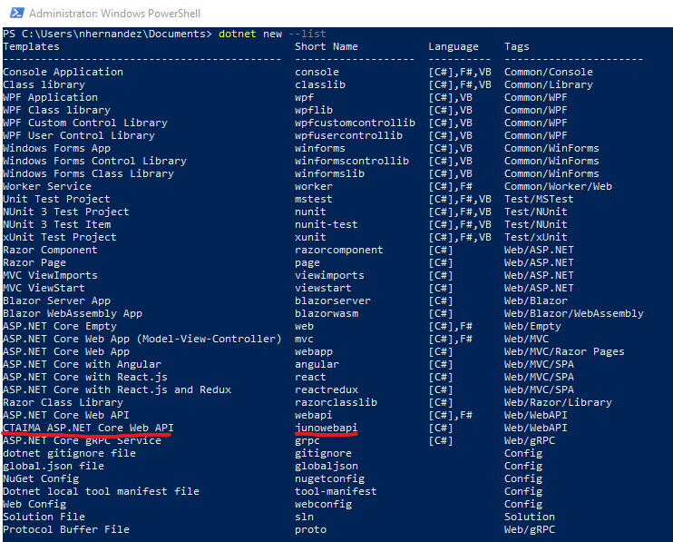
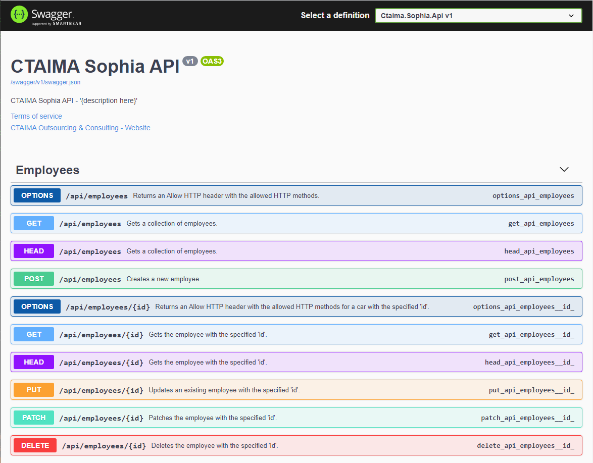
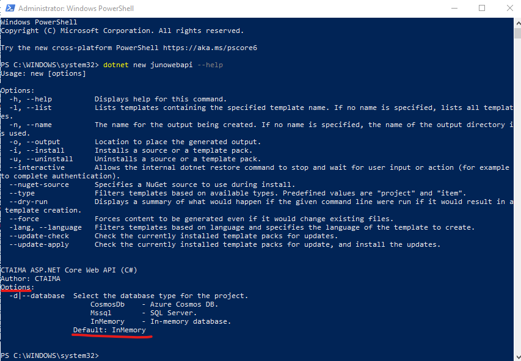
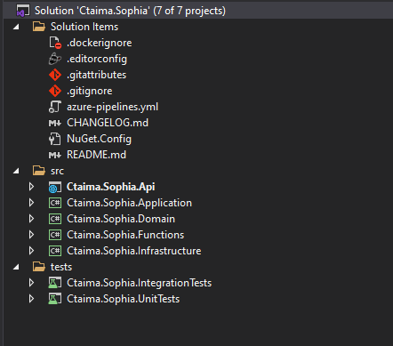

# ASP.NET Core Web API Template

[](https://dev.azure.com/ctaima/Ctaima/_build/latest?definitionId=143&branchName=master) [](https://dev.azure.com/ctaima/Ctaima/_artifacts/feed/ctaima/NuGet/Tradmia.Templates?preferRelease=true)
Template para crear una Web API utilizando ASP.NET Core que contiene una serie de configuraciones iniciales y puede ser utilizada como arquitectura de referencia para la construcción de los microservicios que conformen la plataforma Tradmia.

## Principales tecnologías

* [ASP.NET Core 7](https://docs.microsoft.com/en-us/aspnet/core/?view=aspnetcore-7.0)
* [Entity Framework Core](https://docs.microsoft.com/en-us/ef/core/)
* [FluentValidation](https://fluentvalidation.net/)
* [Application Insights](https://docs.microsoft.com/en-us/azure/azure-monitor/app/app-insights-overview)
* [Azure Key Vault](https://docs.microsoft.com/en-us/azure/key-vault/general/basic-concepts)
* [Azure App Configuration](https://docs.microsoft.com/en-us/azure/azure-app-configuration/overviews)
* [Azure Cosmos DB](https://docs.microsoft.com/en-us/azure/cosmos-db/introduction)
* [xUnit](https://xunit.net/)
* [Docker](https://www.docker.com/)

## ¿Cómo instalar?

Para instalar el template, abrir un terminal y ejecutar el siguiente comando:

```powershell
dotnet new -i "Tradmia.Templates::*"
```



Para comprobar si el template está instalado se debe ejectutar el comando:

```powershell
dotnet new --list
```

 Luego verificar que aparezca en la lista de templates:


Si se quiere desinstalar el template se debe ejecutar el comando:

```powershell
dotnet new -u "Tradmia.Templates"
```

## Solución de problemas de instalación

Si el *personal access token* [(PAT)](https://docs.microsoft.com/en-us/azure/devops/organizations/accounts/use-personal-access-tokens-to-authenticate?view=azure-devops&tabs=preview-page)
usado para acceder a los artefactos de Azure está vencido posiblemente se mostrará el siguiente error:

`Error:` Response status code does not indicate success: 401 (Unauthorized).

`Solución:` En el portal de [Azure DevOps](https://dev.azure.com/ctaima/_usersSettings/tokens) obtener un nuevo PAT y ejecutar el siguiente comando:

```powershell
nuget.exe sources update -Name "YOUR_AZURE_FEED_NAME_HERE" -Source "https://pkgs.dev.azure.com/ctaima/_packaging/ctaima/nuget/v3/index.json" -username any -password YOUR_PAT_VALUE_HERE
```

> **Importante**: Se recomienda descargar la última versión estable de [Nuget.exe](https://www.nuget.org/downloads).

Para ver el **nombre del feed de Azure** ejecutar el comando `nuget.exe sources list` y tomar el que tiene como url `https://pkgs.dev.azure.com/ctaima/_packaging/ctaima/nuget/v3/index.json`. De no existir se puede adicionar con el siguiente comando:

```powershell
nuget.exe sources add -Name "YOUR_AZURE_FEED_NAME_HERE" -Source "https://pkgs.dev.azure.com/ctaima/_packaging/ctaima/nuget/v3/index.json" -username any -password YOUR_PAT_VALUE_HERE
```

## ¿Cómo usar el template?

> **Importante**: Como prerrequisito se debe tener instalada la última versión del  [.NET SDK](https://dotnet.microsoft.com/download).

1. Ubicarse con el terminal en el directorio donde se quiere crear la Web API.
2. Ejecutar el comando: `dotnet new junowebapi -n "MyProject"`, donde *MyProject* es el nombre que se quiere dar al proyecto.
3. Con el IDE Visual Studio abrir el fichero con extensión *.sln* que se ha generado en el directorio seleccionado.
4. Ejecutar el proyecto y verificar que se abra una pestaña del navegador mostrando la interfaz del Swagger UI.


## Selección de funciones opcionales

Con el comando `dotnet new junowebapi --help` se pueden ver las opciones disponible a la hora de crear una nueva API:



Hasta el momento la única opción disponible es la del tipo de proveedor de base de datos que se desea usar.

Por ejemplo para usar CosmosDb se debe ejecutar el siguiente comando:

```powershell
dotnet new junowebapi -n "MyProject" --database CosmosDb
```

> El valor por defecto del tipo de base de datos es [In-Memory database](https://entityframeworkcore.com/providers-inmemory#:~:text=EntityFrameworkCore.,overhead%20of%20actual%20database%20operations.), sin embargo se recomienda usar alguna de las otras opciones disponibles cuando no se esté probando el template.

## Estructura del template

El template fue estructurado siguiendo una arquitectura en capas, para la cual se tomaron como guía algunos principios
de [*Domain Driven Design* (DDD)](https://martinfowler.com/bliki/DomainDrivenDesign.html), pero a la vez intentando mantener la simplicidad, fundamentalmente con el manejo de
la persistencia de datos con [Entity Framework Core](https://docs.microsoft.com/en-us/ef/core/), evitando crear abstracciones sobre este [ORM](https://en.wikipedia.org/wiki/Object%E2%80%93relational_mapping).

> *A veces, estos patrones y reglas técnicas de DDD se perciben como obstáculos con una curva de aprendizaje pronunciada a la hora de implementar opciones de DDD. Pero lo importante no son los patrones en sí, sino organizar el código para que esté en línea con los problemas del negocio y utilizar los mismos términos empresariales (lenguaje ubicuo). Además, las opciones de DDD solo deben aplicarse en el caso de implementar microservicios complejos con reglas de negocio importantes. Las responsabilidades más sencillas, como el servicio CRUD, se pueden administrar con enfoques más sencillos* [1].

[1]: https://docs.microsoft.com/en-us/dotnet/architecture/microservices/microservice-ddd-cqrs-patterns/ddd-oriented-microservice



### Domain

Esta es la capa principal que implementa la lógica de dominio. Incluye entidades, objetos de valor y servicios de dominio para realizar la lógica o reglas del negocio. También puede incluir especificaciones y eventos de dominio.

### Application

La capa de aplicación incluye principalmente servicios de aplicación que utilizan la capa de dominio y los objetos de dominio (servicios de dominio, entidades ...)
para realizar las funcionalidades de aplicación solicitadas. Utiliza objetos de transferencia de datos para obtener datos y devolverlos
a la capa de presentación o servicio distribuido. También puede ocuparse de otros elementos como el almacenamiento en caché, el registro de auditoría,
el mapeo de objetos, etc.

### Api

Esta capa es una Web API basada en ASP.NET Core. Es la responsable de manejar las peticiones HTTP y no debe tener implementada ninguna
lógica de negocio. Puede encargarse de cuestiones transversales como *Authorization*, *Exception Handling* etc.

### Infrastructure

La capa de infraestructura hace que otras capas funcionen: implementa las interfaces que involucren llamadas a dependencias externas.
Puede incluir acceso a bases de datos, integración con un proveedores de correos electrónicos, llamadas a web services etc.
Es compatible con otras capas al implementar los conceptos abstractos de ellas.

## Problemas conocidos

* Actualmente cuando se intenta ejecutar el template de manera local con Docker ocurre una excepción
provocada por la imposibilidad de obtener un token para acceder al serivicio de KeyVault.

## Roadmap

### Los próximos releases deben incluir las siguientes funcionalidades

* Cache centralizada con [Redis](https://azure.microsoft.com/en-us/services/cache/).
* Servicios de infraestructura para integración con [Storage Account](https://docs.microsoft.com/en-us/azure/storage/common/storage-account-overview).
* Paginado y filtros.
* Ejemplo de pruebas unitarias y de integración.
* Ejemplos de tareas en background.
* Ejemplo que involucre un servicio de dominio.
* Traducción de README.md al inglés.
  